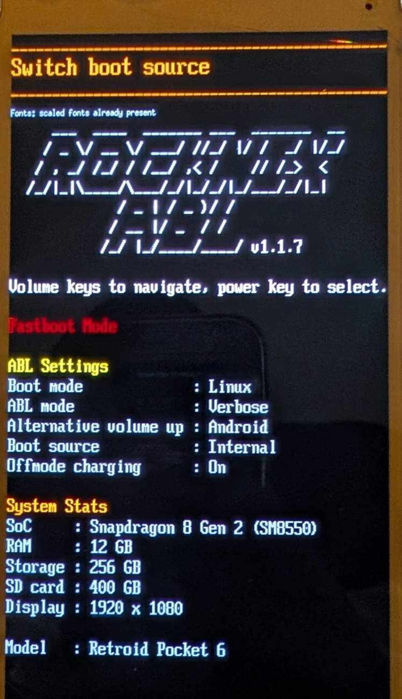
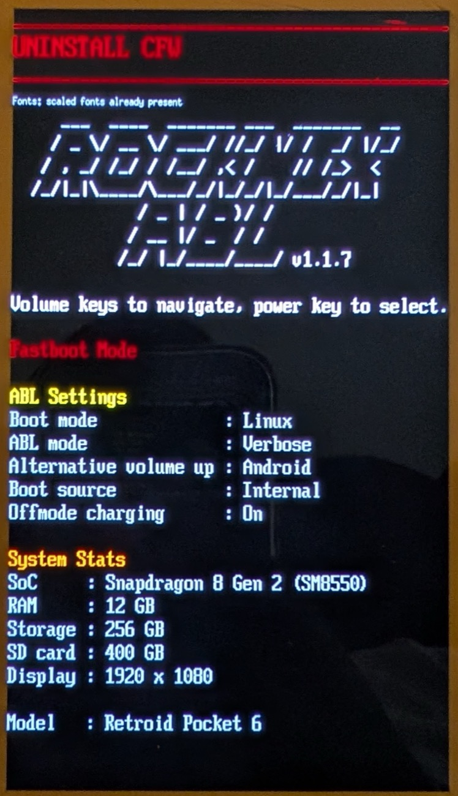

# Install pocknix-os to internal storage (and uninstall)

> **RECOMMENDED: Install the ROCKNIX ABL first** if you have not already - see
> [How to install](../README.md#how-to-install) in the README. It is what makes switching between
> the internal install and the SD card a menu choice, and it can remove an internal install on its
> own.

## The ROCKNIX boot menu

Everything below is driven from the bootloader menu, so it is worth knowing first. **Hold Volume −**
while powering on to open it. **Volume keys move through the entries** (the highlighted one is the
banner at the top of the screen) and the **power key selects**. The current settings are listed
under **ABL Settings**:

- **Boot mode** - what boots by default: **Linux** or **Android**.
- **Boot source** - which disk Linux boots from: **Internal**, **SD Card**, or **USB**.
- **Alternative volume up** - what holding **Volume +** at power-on boots instead, without changing
  the default (usually **Android**).

Two entries do the work in this guide: **Switch boot source** and **Uninstall CFW**.

Boot-source switching needs the ROCKNIX ABL **v1.1.7 or newer**. If yours is older, update it from
the running system: **Pocknix Tools → Bootloader: install or update to …**, or `pocknix-update-abl`
in a terminal.

---

## Install to internal

> ⚠️ Installing to internal shrinks Android's userdata partition, so Android reformats it on its
> next boot. Android still boots, but its apps and data are gone - effectively a factory reset. Back
> up anything you care about first.

You must be **booted from a Pocknix SD** (the installer clones the *running* system to internal).

Desktop mode: **Pocknix Tools → Install or remove internal Pocknix…**, pick how much internal
storage Android keeps, and let it run. Or from a terminal:

```bash
# 1. dry-run - prints the exact partition plan, makes NO changes. Review it.
pocknix-install-internal --dry-run

# 2. for real. It asks for the new Android userdata size (or pass --userdata-gib N),
#    then shrinks userdata, creates the boot + POCKNIX_ROOT partitions, and rsyncs the
#    running rootfs across (the clone is the slow part - minutes off a slow SD).
pocknix-install-internal
#   non-interactive equivalent:
#   pocknix-install-internal --yes --userdata-gib 16
```
Flags: `--dry-run`, `--yes`/`-y`, `--userdata-gib N`, `--device /dev/sdX` (default `/dev/sda`).

### Then point the bootloader at it

Installing does not change what boots - the device still starts from the SD card. Power off, then
hold **Volume −** to open the boot menu and set **Switch boot source** to **Internal**.



Switch it back to **SD Card** whenever you want to boot the SD again; nothing on either disk
changes.

**On a stock SM8250 bootloader there is nothing to switch** - it has no boot-source setting and
always prefers the SD card. To boot the internal install, power off, take the SD card out, and power
back on; put it back in to boot the SD again.

---

## Uninstall from internal

> ⚠️ Uninstalling from internal regrows Android's userdata partition back to its original size, so
> Android reformats it on its next boot. Android still boots, but its apps and data are gone -
> effectively a factory reset. Back up anything you care about first.

### From the ROCKNIX ABL (recommended)

This needs the **ROCKNIX ABL** (v1.1.7 or newer, where the entry is named *Uninstall CFW*). A device
still on its stock bootloader has no such menu - use the SD-card path below instead.

Hold **Volume −** at power-on and select **Uninstall CFW**. It deletes the internal Linux install
and grows Android's partition back to its full size in one step - no SD card, no second boot.



### From a running pocknix SD

You **can't repartition the disk you're booted from**, so this has to run from the SD. Set **Switch
boot source** to **SD Card** in the boot menu (or, on a stock SM8250 bootloader, just insert the
SD), boot it, then use **Pocknix Tools → Install or remove internal Pocknix… → Remove, restore
Android**, or a terminal:

```bash
pocknix-uninstall-internal --dry-run     # review the plan
pocknix-uninstall-internal
```
It removes the internal boot and `POCKNIX_ROOT` partitions and grows Android `userdata` back to fill
the disk. Flags: `--dry-run`, `--yes`/`-y`, `--device /dev/sdX` (default `/dev/sda`). It refuses to
run if `/` is on the target device, as a guard.

---

## Put a *new* version on internal (clean reinstall)

```
boot menu -> Switch boot source: SD Card, and boot the SD carrying your new build
  -> pocknix-uninstall-internal      (clears the old install so the installer sees a fresh disk)
  -> pocknix-install-internal        (clones the fresh SD onto internal)
  -> boot menu -> Switch boot source: Internal
```

**Pocknix Tools → *Install or remove internal Pocknix…* → Reinstall Pocknix** does the two middle
steps in one go.

For just iterating on packages/scripts you usually don't need to reinstall - deploy onto the running
internal system via pocknix package updates.

---

## Restoring the stock bootloader

Removing pocknix does not put the original Android bootloader back - the ROCKNIX ABL stays until you
flash your backup over it. Keeping the ROCKNIX ABL is mostly harmless, but if you're after a *full*
return to stock then this is the final step. It needs the `abl_a.img` / `abl_b.img` backup you were
told to make (and copy off the device) when you first flashed the ROCKNIX ABL.

Where your backup is, depending on how you flashed:

- **Android's `backup_abl.sh`** (the [README](../README.md#how-to-install) steps): it wrote
  `abl_a.img` + `abl_b.img` into `rocknix_abl/` on Android internal storage - gone if you have since
  installed to internal, so use the copy you were told to keep off the device.
- **`pocknix-update-abl` / Pocknix Tools**: it saved the bootloader it replaced to
  `/flash/rocknix_abl/` and, when an SD card was mounted, copied it to `pocknix-abl-backup/` on that
  card. Note this is only *stock* if that run was the first time the device's bootloader was ever
  replaced.

Then, from Android:

1. **Boot Android.** If pocknix is on internal storage, remove it first (**Uninstall CFW** above) -
   otherwise Android has no room to come back. Then boot the menu's **Switch boot mode** to
   **Android**, or hold **Volume +** at power-on.
2. Put a `rocknix_abl` folder at the root of Android's internal storage if it isn't there any more
   (copy it off a pocknix SD card, same as during install), and **copy your `abl_a.img` and
   `abl_b.img` backups into it**. The names and the location matter - the script reads exactly
   `rocknix_abl/abl_a.img` and `rocknix_abl/abl_b.img`.
3. Open **Settings → Handheld Settings → Advanced → Run Script as Root**, navigate to that folder,
   and run **`restore_backup_abl.sh`**.
4. Reboot. The device is back on its factory bootloader and boots Android the way it shipped.

> ⚠️ Keep the device plugged in while doing ABL writes: an interrupted or wrong bootloader write leaves a
> device that needs a PC to recover.

After this, an SM8550 device (RP6, Odin 2) can no longer boot pocknix at all - the stock bootloader
has no Linux boot path. Flash the ROCKNIX ABL again (README step 2) to bring it back.
