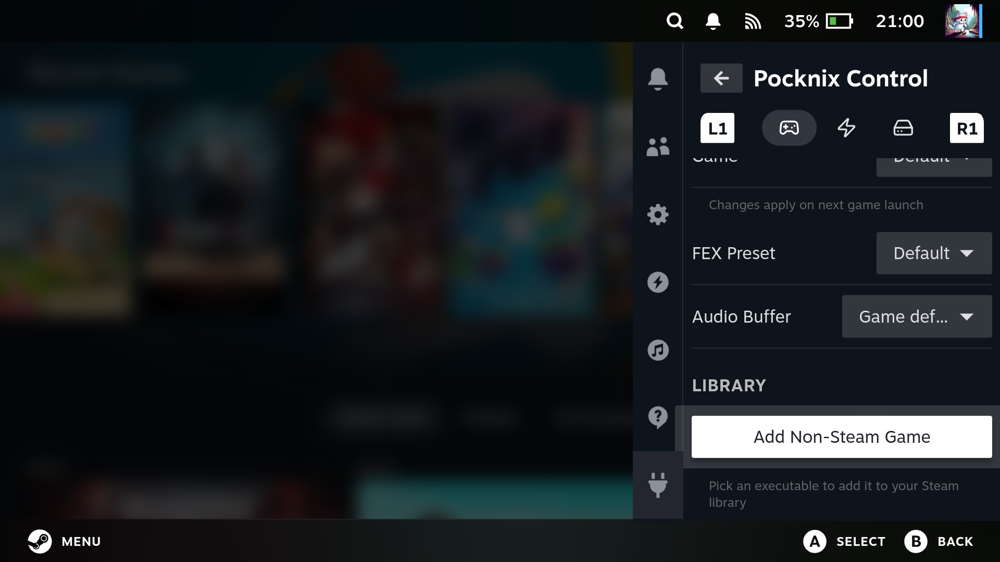

# Pocknix Control

**Pocknix Control** is pocknix-os's built-in Decky plugin: a control panel inside the Steam
session for tuning the handheld and managing the system without leaving the couch (or touching
a terminal).

Open the **Quick Access menu** in the Steam session, then pick **Pocknix Control** under the
plug icon. The plugin is split into four tabs - switch between them with **L1/R1** or by
tapping the icons:

| Tab | What it does |
|---|---|
| 🎮 Games | Per-game performance/audio tweaks, add non-Steam games |
| ⚡ Power | Fan curve and CPU scheduler |
| 💾 Storage | Format a microSD card for Steam |
| 🔄 Updater | Check for and install system updates |

Settings save automatically as you change them.

## Games

### Game tweaks

Tweaks can be set globally (the **Default** entry in the **Game** dropdown) or per game.
Every installed Steam game is listed, and so are non-Steam shortcuts (marked `· non-Steam`).
If you open the menu while a game is running, that game is preselected. To override the
defaults for one game, select it and flip **Use Per-Game Settings** on.

Changes apply on the **next game launch**.

- **FEX Preset**: **Default**, **Fast**, or **Compatible**. Trades x86 translation accuracy
  for speed. Try **Fast** for more FPS; switch to **Compatible** if a game misbehaves
  (crashes, glitched physics, odd audio).
- **Audio Buffer**: **Game default**, **60**, **90**, or **120 ms**. Raising the buffer
  absorbs audio crackle in busy scenes (an FEX audio-mixer quirk) at the cost of a little
  extra audio latency. 120 ms clears crackle and is inaudible in most games. Keep it low (or
  on Game default) for timing-sensitive titles - rhythm games, fighting games, anything where
  you play to the beat or need tight audio cues.

### Adding non-Steam games

On a normal desktop you would add non-Steam games through the Steam client's own
**Games → Add a Non-Steam Game to My Library** dialog. **On pocknix-os that route does not
work**: Steam's desktop client is an X11 application, and Plasma Mobile cannot summon new
windows for it - the file-browser dialog never appears on screen.

Pocknix Control provides the same feature natively in game mode instead:

1. In the **Games** tab, scroll to **Library** and press **Add Non-Steam Game**.
2. A file picker opens in your home directory. Navigate to the executable you want
   (a Linux binary, script, or Windows `.exe`) and select it.
3. Give it a name, and choose whether to **Launch with Proton**. This switches on
   automatically for `.exe` files - Windows programs need it, native Linux ones do not.
4. Press **Add to Library**. The game appears in your Steam library right away, and also
   shows up in the tweaks dropdown above so you can give it its own FEX/audio settings.

## Power

- **Fan Curve**: **Quiet**, **Moderate**, or **Performance**. Applies live, no restart.
- **CPU Scheduler**: **Autopilot** (the `scx_lavd` default - adapts to load on the fly) or
  **Performance** (keeps the CPU aggressive at the cost of battery and heat).

## Storage

Formats a microSD card so Steam can use it as game storage.

On a Steam Deck this lives in Steam itself (**Settings → Storage → Format SD Card**). Steam's
native format button can work on these devices too, but I have not figured out how to wire it
up yet, so Pocknix Control provides the option here in the meantime.

The tab shows the detected card (label, size, current filesystem); set a label if you like
and press **Format SD Card**.

> **Formatting erases everything on the card.** The confirmation dialog makes you type
> `format` before it will run, so you cannot trigger it by accident.

The card is formatted the same way a Steam Deck would (ext4 with casefolding), mounts
automatically, and gets added to Steam as a library folder - Steam offers it as an install
target right away, and cards formatted here also work in a real Steam Deck (and vice versa).

## Updater

System updates, without leaving game mode:

1. **Check for Updates** lists everything pending (kernel included - updates ship through
   the pocknix pacman repo, so no reflashing).
2. **Install Updates** downloads and installs the lot. Keep the device powered; a running
   game may stutter while it installs.
3. Restart when it finishes to apply everything.

The update keeps running even if you close the Quick Access menu - reopen the tab to check
on progress. If you prefer, the same update is just `sudo pacman -Syu` in a terminal, or the
**Pocknix Updater** shortcut in desktop mode.
