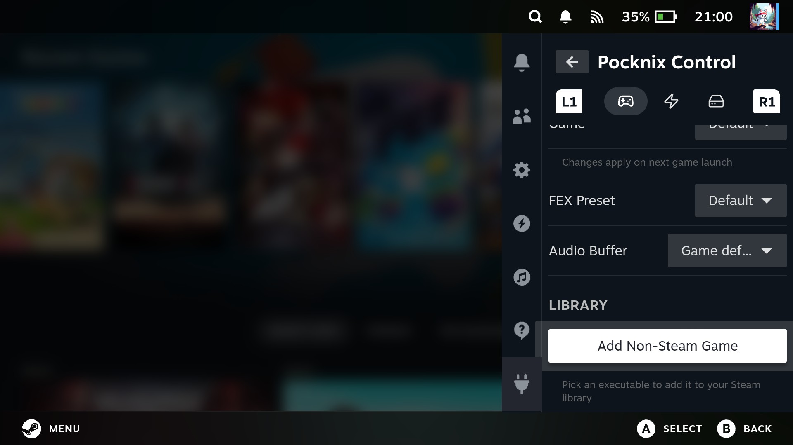

# Pocknix Control

**Pocknix Control** is pocknix-os's built-in Decky plugin: a control panel inside the Steam
session for tuning the handheld and managing the system without leaving the couch (or touching
a terminal).

Open the **Quick Access menu** in the Steam session, then pick **Pocknix Control** under the
plug icon. The plugin is split into four tabs - switch between them with **L1/R1** or by
tapping the icons:

| Tab | What it does |
|---|---|
| 🎮 Games | Per-game performance/audio tweaks, add non-Steam games |
| ⚡ Power | Fan curve and CPU scheduler |
| 💾 Storage | Format a microSD card for Steam, and share your files over the network |
| 🔄 Updater | Check for and install system updates, roll back the last update |

Settings save automatically as you change them.

## Games

### Game tweaks

Tweaks can be set globally (the **Default** entry in the **Game** dropdown) or per game.
Every installed Steam game is listed, and so are non-Steam shortcuts (marked `· non-Steam`).
If you open the menu while a game is running, that game is preselected. To override the
defaults for one game, select it and flip **Use Per-Game Settings** on.

Changes apply on the **next game launch**.

- **FEX Preset**: **Default**, **Fast**, or **Compatible**. Trades x86 translation accuracy
  for speed. Try **Fast** for more FPS; switch to **Compatible** if a game misbehaves
  (crashes, glitched physics, odd audio).
- **Audio Buffer**: **Game default**, **60**, **90**, or **120 ms**. Raising the buffer
  absorbs audio crackle in busy scenes (an FEX audio-mixer quirk) at the cost of a little
  extra audio latency. 120 ms clears crackle and is inaudible in most games. Keep it low (or
  on Game default) for timing-sensitive titles - rhythm games, fighting games, anything where
  you play to the beat or need tight audio cues.

### Adding non-Steam games

On a normal desktop you would add non-Steam games through the Steam client's own
**Games → Add a Non-Steam Game to My Library** dialog. **On pocknix-os that route does not
work**: Steam's desktop client is an X11 application, and Plasma Mobile cannot summon new
windows for it - the file-browser dialog never appears on screen.

Pocknix Control provides the same feature natively in game mode instead:

1. In the **Games** tab, scroll to **Library** and press **Add Non-Steam Game**.
2. A file picker opens in your home directory. Navigate to the executable you want
   (a Linux binary, script, or Windows `.exe`) and select it.
3. Give it a name, and choose whether to **Launch with Proton**. This switches on
   automatically for `.exe` files - Windows programs need it, native Linux ones do not.
4. Press **Add to Library**. The game appears in your Steam library right away, and also
   shows up in the tweaks dropdown above so you can give it its own FEX/audio settings.

## Power

- **Fan Curve**: **Quiet**, **Moderate**, or **Performance**. Applies live, no restart.
- **CPU Scheduler**: **Autopilot** (the `scx_lavd` default - adapts to load on the fly) or
  **Performance** (keeps the CPU aggressive at the cost of battery and heat).

## Storage

Formats a microSD card so Steam can use it as game storage.

On a Steam Deck this lives in Steam itself (**Settings → Storage → Format SD Card**). Steam's
native format button can work on these devices too, but I have not figured out how to wire it
up yet, so Pocknix Control provides the option here in the meantime.

The tab shows the detected card (label, size, current filesystem); set a label if you like
and press **Format SD Card**.

> **Formatting erases everything on the card.** The confirmation dialog makes you type
> `format` before it will run, so you cannot trigger it by accident.

The card is formatted the same way a Steam Deck would (ext4 with casefolding), mounts
automatically, and gets added to Steam as a library folder - Steam offers it as an install
target right away, and cards formatted here also work in a real Steam Deck (and vice versa).

### File sharing

The same tab can turn the device into a network share, so you can drag ROMs, BIOS files and
emulator firmware onto it from another computer instead of moving a card back and forth. It
needs no extra software on either end: macOS Finder, Windows Explorer and Linux file managers
all speak SMB out of the box.

Samba is not shipped in the image (74.5 MB installed), so the first time you use this the
section offers a 7.4 MB download. After that, **Share my home folder** flips it on and off, and
the setting survives reboots.

Two shares appear on the network, both as **Guest** with no password: `deck` (your home folder,
including `Emulation/` and every emulator's own firmware directory) and `sdcard` (the card
slot). macOS and Linux find the device by name in their file manager's network view; on Windows
use `\\pocknix`.

> **There is no password.** Anyone on the same network can read and write everything in your
> home folder, Steam login and SSH keys included. Sharing only answers on private home-network
> address ranges, so public wifi cannot reach it, but turn it off when you are done.

The same toggle exists in **Pocknix Tools** on the desktop side, and both drive the same
`pocknix-share` command - flipping it in one place is reflected in the other.

## Updater

System updates, without leaving game mode:

1. **Check for Updates** lists everything pending (kernel included - updates ship through
   the pocknix pacman repo, so no reflashing).
2. **Install Updates** downloads and installs the lot. Keep the device powered; a running
   game may stutter while it installs.
3. Restart when it finishes to apply everything (**Restart Now** appears right there).

The update keeps running even if you close the Quick Access menu - reopen the tab to check
on progress. If you prefer, the same update is just `sudo pacman -Syu` in a terminal, or the
**Pocknix Updater** shortcut in desktop mode.

### Rolling back an update

Every update automatically takes a **snapshot** of the system first - so if an update breaks
something, you can undo it from the same tab.

The **Rollback** section shows the last snapshot: when it was taken and which packages it
would undo. To use it:

1. Press **Roll Back Last Update**. The confirmation tells you exactly what gets restored -
   and what is kept: **your games, saves and settings are never touched** by a rollback. If
   the update included a kernel, the previous kernel comes back too.
2. Confirm. It takes a few seconds, then press **Reboot Now**.
3. The device boots straight back into the system as it was before the update.

After a rollback the tab shows a *"System was rolled back"* notice and the rollback button
disappears - the system already **is** the restored state, so there is nothing to undo. It
all comes back the next time you install an update.

Notes:

- The section also shows free storage. If the card is nearly full, snapshots are skipped
  (updates still install - you just would not be able to undo that one).
- The QAM always rolls back the **last** update only. To go further back, or if game mode
  itself is broken, use the **Pocknix Rollback** shortcut in desktop mode or the terminal -
  see [snapshots.md](snapshots.md) for those and for how it all works underneath.
- Older pocknix installs (before the snapshot feature) do not show the Rollback section at
  all; a reflash with a current image is what enables it.
